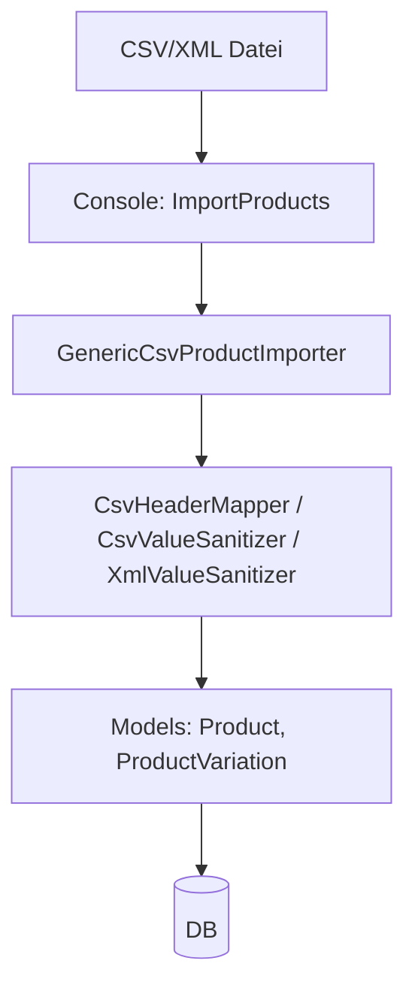
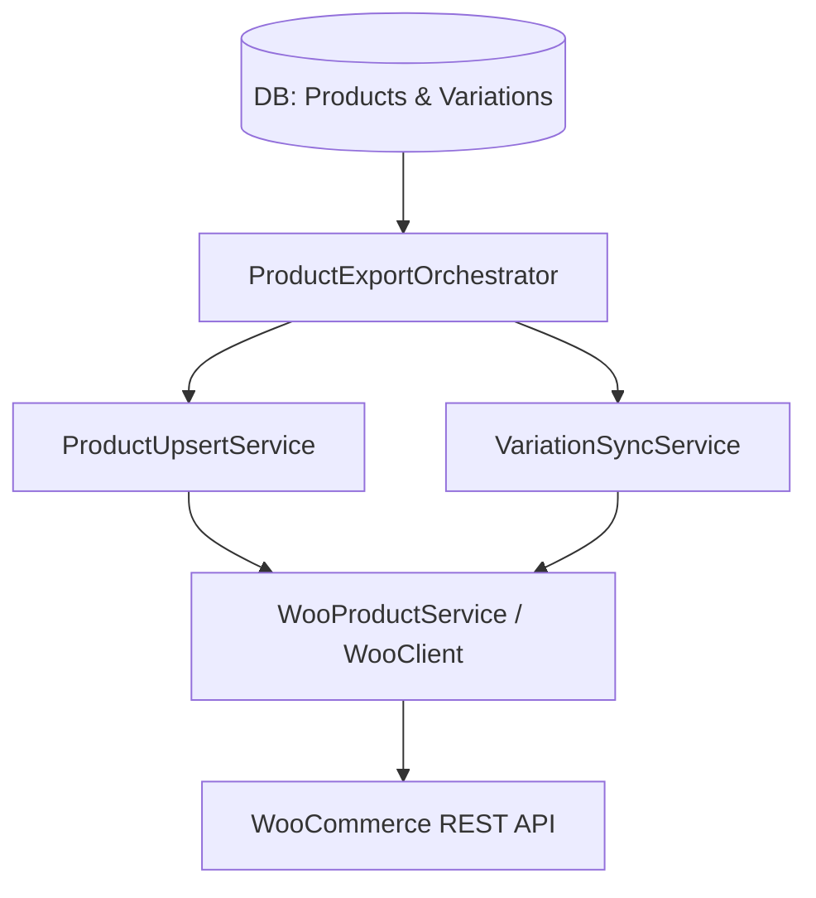

# GeoAlpin – Import- / Export-Ablauf

## Import Flow (CSV/XML)

### Zentraldateien

- `app/Console/Commands/ImportProducts.php` – Methoden: 1, Zeilen: 51

- `app/Filament/Imports/ProductImporter.php` – Methoden: 3, Zeilen: 73

- `app/Helpers/CsvHeaderMapper.php` – Methoden: 1, Zeilen: 25

- `app/Helpers/CsvValueSanitizer.php` – Methoden: 7, Zeilen: 55

- `app/Helpers/XmlValueSanitizer.php` – Methoden: 10, Zeilen: 71

- `app/Importers/GenericCsvProductImporter.php` – Methoden: 9, Zeilen: 589

## Export / WooCommerce Sync Flow

### Trigger-Pfade

- **Filament BulkAction**: `ProductResource/Actions/SyncVariationsBulkAction.php` (Varianten)

- **Console**: `WooSyncProductCommand`, `WooSyncVariationsCommand`

- **Webhook**: `WooWebhookController` verarbeitet eingehende Ereignisse

### Zentraldateien (Export)

- `app/Console/Commands/WooExportSample.php` – Methoden: 1, Zeilen: 42

- `app/Console/Commands/WooPingCommand.php` – Methoden: 1, Zeilen: 94

- `app/Console/Commands/WooResetMappingsCommand.php` – Methoden: 2, Zeilen: 156

- `app/Console/Commands/WooShopTest.php` – Methoden: 2, Zeilen: 74

- `app/Console/Commands/WooSyncProduct.php` – Methoden: 2, Zeilen: 50

- `app/Console/Commands/WooSyncProductCommand.php` – Methoden: 1, Zeilen: 174

- `app/Console/Commands/WooSyncVariationsCommand.php` – Methoden: 1, Zeilen: 168

- `app/Http/Controllers/WooWebhookController.php` – Methoden: 1, Zeilen: 72

- `app/Services/Export/WooCommerceExporter.php` – Methoden: 2, Zeilen: 41

- `app/Services/Woo/ProductExportOrchestrator.php` – Methoden: 2, Zeilen: 138

- `app/Services/Woo/ProductUpsertService.php` – Methoden: 8, Zeilen: 348

- `app/Services/Woo/VariationPayloadBuilder.php` – Methoden: 6, Zeilen: 260

- `app/Services/Woo/VariationSyncService.php` – Methoden: 8, Zeilen: 338

- `app/Services/Woo/WooAttributeResolver.php` – Methoden: 3, Zeilen: 60

- `app/Services/Woo/WooClient.php` – Methoden: 7, Zeilen: 109

- `app/Services/Woo/WooProductLookupService.php` – Methoden: 2, Zeilen: 102

- `app/Services/Woo/WooProductService.php` – Methoden: 4, Zeilen: 218
